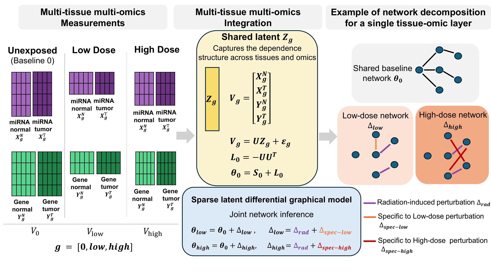
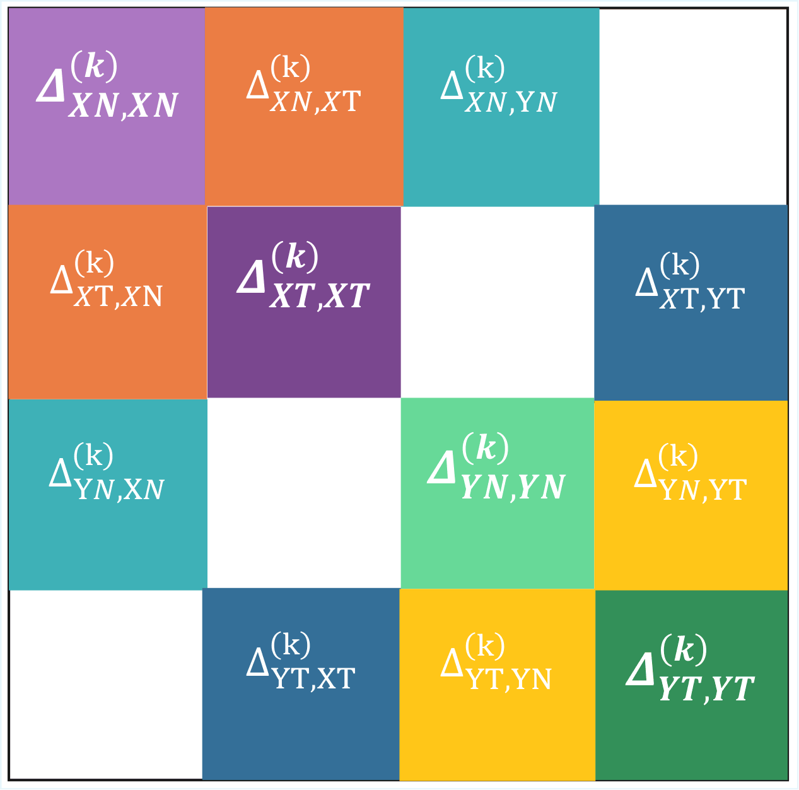

# Multi-DiffNet

Latent differential graphical models for multi-tissue and multi-omics network inference.

Multi-DiffNet is a Python package for the joint estimation of sparse differential interaction networks across multiple biological conditions, tissues, and omics layers using latent Gaussian graphical models.

The framework combines:

- sparse precision matrix estimation,
- latent variable modeling,
- differential network inference,
- fusion regularization across groups.

It is designed for high-dimensional biological datasets where the number of variables exceeds the number of samples.

---

# Overview

Multi-DiffNet jointly models:

- multiple condition groups,
- multiple omics layers,
- multiple tissues,
- shared latent dependence structures,
- sparse condition-specific differential networks.

The model decomposes precision matrices into:

- a sparse baseline interaction network,
- sparse differential perturbations,
- a shared low-rank latent component.

---

# Model overview

<p align="center">
  
</p>

---

The figure below illustrates the structured organization of the differential precision matrices estimated by Multi-DiffNet for each condition group \(k\). Diagonal blocks correspond to intra-omics and intra-tissue conditional dependency networks, while off-diagonal blocks capture cross-omics and cross-tissue interactions.

<p align="center">
  
</p>

---

# Installation

Clone the repository:

```bash
git clone https://github.com/asmanouira/Multi-DiffNet.git
cd Multi-DiffNet
```

Install the package locally:

```bash
pip install -r requirements.txt
pip install -e .
```

---

# Quick example

Run the simulated example:

```bash
python simulation/main_test.py
```

This script:

- generates one simulated multi-group multi-omics mutli-tissue dataset,
- fits Multi-DiffNet,
- estimates sparse and latent components.